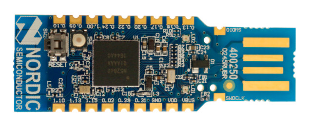

## Support for nRF5 development boards

### Supported boards

#### [pca10059](pca10059)

Nordic [nRF52840-Dongle](https://www.nordicsemi.com/Software-and-tools/Development-Kits/nRF52840-Dongle) (PCA10059)

### Directory structure

Every supported board has its directory here. Each of them contains three subdirectories:

#### board

The `board` directory contains Go packages that provide the interface to the peripherals available on the board such as buttons, LEDs, etc.
There is also an `init` package that imported configures the whole system for typical usage.
Usually you don't need to import it explicitly because any other package in the `board` directory imports `init` itself to ensure proper operation.

#### doc

The `doc` directory may contain documentation, diagrams, photos and other useful resources.

#### examples

The `examples` directory contains simple programs that demonstrate how to use the available Go packages to work with the board and various external peripherals connected to it.
